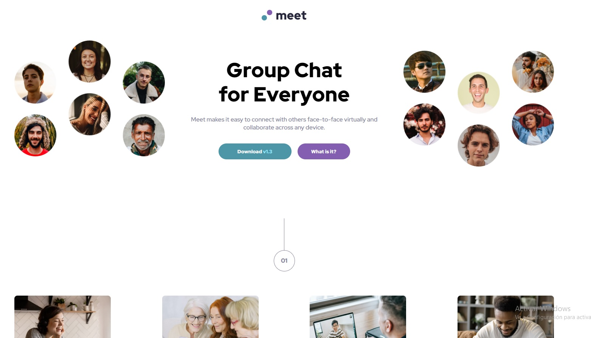

# Meet Landing Page

  - [Overview](#overview)
  - [Screenshot](#screenshot) 
  - [Links](#links)
  - [Built with](#built-with)
  - [Author](#author)

### Overview

This project consists of a simple but adaptable home page, it contains text, images and 2 buttons which adapt each and every one of them to different device sizes.

### Screenshot

### Links

- Solution URL: [GitHub](https://github.com/Pablo-Zallio-Dev/meet__landing__page)
- Live Site URL: [Netlify](https://landingmeet.netlify.app/)

## My process

### Built with

- Semantic HTML5 markup
- CSS custom properties
- Flexbox
- CSS Grid
- Mobile-first workflow

## Author

- Linkedin - [Pablo Zallio](https://www.linkedin.com/in/pablo-damian-zallio-zabala-140b83278/)
- GitHub - [Pablo-Zallio-Dev](https://github.com/Pablo-Zallio-Dev)
- Frontend Mentor - [@Pablo-Zallop-Dev](https://www.frontendmentor.io/profile/Pablo-Zallio-Dev)

